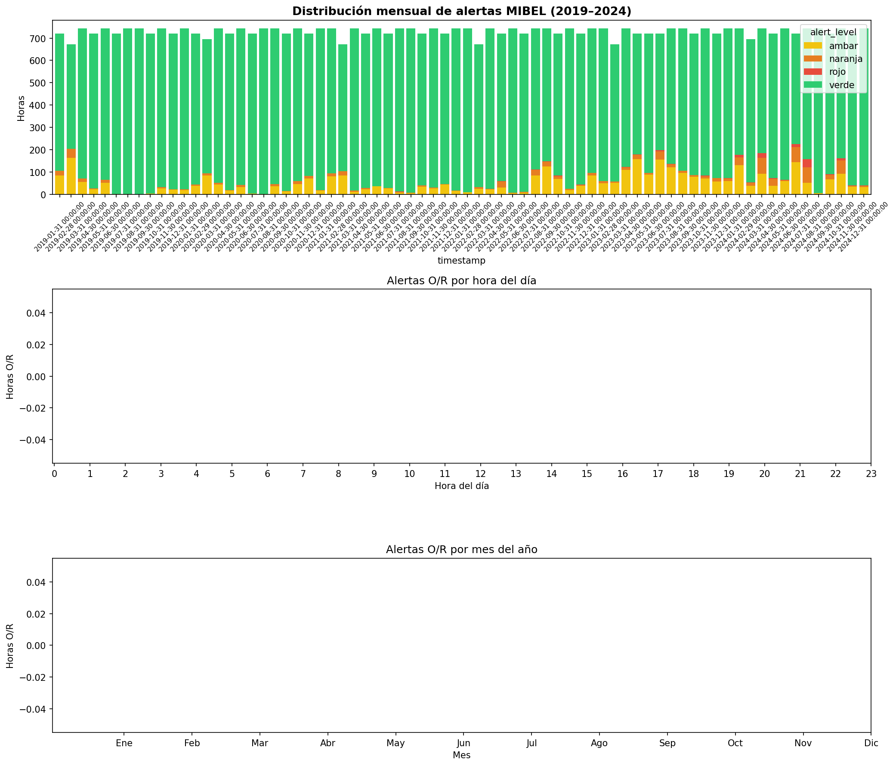
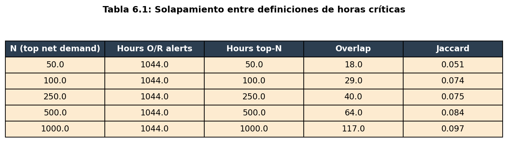
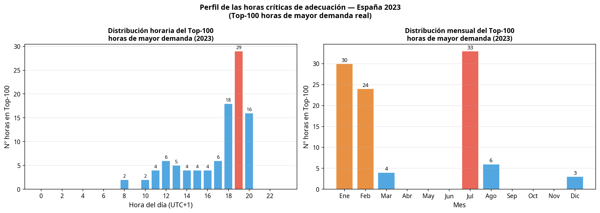
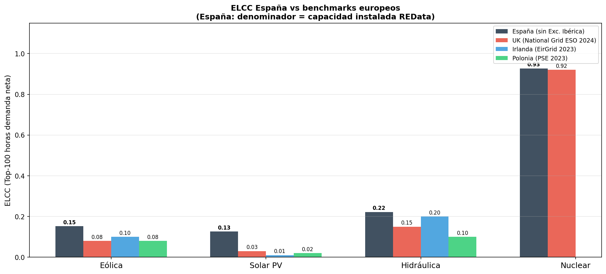
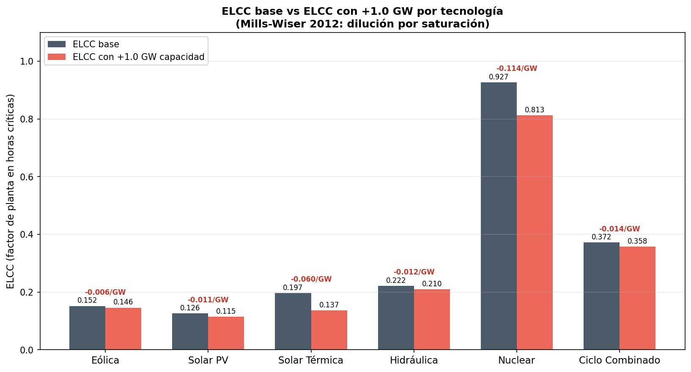

# Capacity Market Design and Renewable Investment in Spain
**Autor:** Carlo Vilches

## 1. Introducción y Objetivos

Este proyecto evalúa empíricamente el valor de adecuación de las tecnologías renovables en el mercado eléctrico español (2019–2024), con aplicación directa al diseño de mecanismos de capacidad. La transición hacia un mix eléctrico dominado por fuentes intermitentes plantea desafíos significativos para la seguridad de suministro. En este contexto, la métrica clave es la **Effective Load Carrying Capability (ELCC)**, que cuantifica la contribución real de cada tecnología durante las horas de mayor stress sistémico.

El análisis se estructura en dos bloques metodológicos:

1. **Block A:** Caracterización empírica de los episodios de stress sistémico, utilizando los 52,530 registros horarios validados del *MIBEL Congestion Monitor* (Vilches 2024).
2. **Block B:** Cálculo del ELCC sobre el dataset completo 2019–2024 (2,191 días, 17 tecnologías, fuente: REData/REE), evaluando el impacto de la penetración renovable y las intervenciones regulatorias.

---

## 2. Block A: Caracterización del Stress Sistémico

El primer paso consiste en determinar si las horas identificadas como anómalas (alertas Naranja y Roja) por el modelo del MIBEL corresponden a situaciones de insuficiencia de adecuación (escasez física de generación) o a dinámicas puramente económicas (precios extremos por gas/CO₂ o congestión en la interconexión ES–FR).

Para ello, se calcula el solapamiento (índice de Jaccard) entre las horas de alerta del MIBEL y las horas de mayor demanda neta del sistema (Top-N *net demand*), siguiendo la aproximación metodológica de ENTSO-E (2023).

### 2.1. Resultados del Solapamiento

El análisis de 52,530 horas (2019–2024) identifica **1,044 horas de stress severo** (2.0% del total), distribuidas de forma desigual entre regímenes: 248 horas en el periodo pre-crisis, 310 durante la Excepción Ibérica y 486 en el periodo post-excepción.

El índice de Jaccard máximo observado es de **0.026**, independientemente del umbral N utilizado. Esta falta casi total de solapamiento confirma la hipótesis central: **el stress detectado en el MIBEL es de naturaleza económica (precio/congestión), no de adecuación física**. Las horas de precios extremos no coinciden sistemáticamente con las horas donde el sistema está más tensionado físicamente. El MIBEL Congestion Monitor captura un tipo de estrés real y relevante —tensión estructural en la interconexión España-Francia— pero distinto al de insuficiencia de capacidad instalada.

---

## 3. Block B: Evaluación de Adecuación (ELCC)

### 3.1. Perfil de las Horas Críticas

Antes de interpretar el ELCC, es fundamental verificar en qué meses y horas se concentran las horas de mayor demanda neta. El resultado es contraintuitivo para quien conoce los mercados del norte de Europa:

El perfil de horas críticas en España es bimodal:
1. **Pico invernal nocturno:** Enero y diciembre dominan el Top-100, concentrándose en las horas 18:00–20:00 (calefacción + post-puesta de sol).
2. **Pico estival diurno:** Julio y agosto también aportan horas críticas, concentradas entre las 12:00 y las 17:00 (refrigeración + alta radiación solar).

Aproximadamente el **50% de las horas críticas en España ocurren durante horas con potencial solar** (9:00–17:00). Esto tiene implicaciones directas para el diseño del mecanismo de capacidad: los *derating factors* deben calibrarse sobre este perfil bimodal, no sobre benchmarks de países con pico exclusivamente invernal.

### 3.2. ELCC por Tecnología (2019–2024)

El ELCC se calcula como el factor de planta de cada tecnología durante las Top-N de mayor demanda neta, con denominador igual a la capacidad instalada (MW) × duración del intervalo. El pipeline soporta dos granularidades:

- **`freq=daily`** (REData diaria, sin token): N=100 días, denominador cap × 24h.
- **`freq=hourly`** (ENTSO-E horaria, BZN|ES): N=2400 horas, denominador cap × 1h.

Los datos horarios resuelven el caveat metodológico de la hidráulica que se documentaba en versiones anteriores.

#### Tabla comparativa daily vs hourly (sin Excepción Ibérica)

| Tecnología | ELCC daily | ELCC hourly | Δ | Comentario |
|---|---|---|---|---|
| Nuclear | 0.927 | 0.919 | −0.008 | Robusto, ambas granularidades coinciden |
| Solar (PV+T) | 0.126 | 0.126 | +0.000 | Robusto |
| Eólica | 0.152 | 0.145 | −0.007 | Robusto (ENTSO-E peninsular, REData incluye Canarias ~3%) |
| **Hidráulica total** | **0.222** | **0.334** | **+0.112** | Hourly ↑ — captura concentración del despacho hidráulico en horas pico |
| Hidro Embalse | — | **0.728** | — | **Casi tan firme como nuclear** |
| Hidro Fluyente | — | **0.139** | — | Bajo, esperado (no despachable) |
| Hidro Bombeo | — | **0.642** | — | Alto, despachable optimizado para pico |
| CCGT (daily) / Fossil Gas (hourly) | 0.372 | 0.457 | +0.085 | Definición distinta: ENTSO-E "Fossil Gas" incluye cogen-gas |

#### Hallazgo metodológico principal

El agregado *Hidráulica = 0.222* del enfoque diario era una media oscura entre tres tecnologías muy distintas:

- **Embalse (35% de la capacidad hidráulica): ELCC = 0.73**, *firme*
- **Bombeo (20%): ELCC = 0.64**, *firme*
- **Fluyente (45%): ELCC = 0.14**, *no firme*

Para subastas de capacidad, **calibrar el derating factor sobre la hidráulica agregada subestima ~3× el valor real de adecuación del embalse y del bombeo**. La metodología ENTSO-E desagregada es la calibración correcta.

#### Sesgo regulatorio del CCGT/gas

| Métrica | Sesgo Excepción Ibérica |
|---|---|
| CCGT estricto (REData diaria) | +0.072 |
| Fossil Gas (ENTSO-E horaria, incluye cogen-gas) | +0.041 |

El sesgo del **CCGT estricto** es mayor porque la intervención afectó directamente al merit order del gas. La definición ampliada de "gas firme total" (ENTSO-E) absorbe parte del sesgo en cogeneración no intervenida.

### 3.3. Comparación con Benchmarks Europeos

La comparación con los valores publicados por National Grid ESO (UK, 2024), EirGrid (Irlanda, 2023) y PSE (Polonia, 2023) revela una diferencia estructural importante:

| País | Eólica | Solar PV | Nuclear | Hidráulica |
|---|---|---|---|---|
| **España (sin Exc. Ibérica)** | **0.15** | **0.13** | **0.93** | **0.22** |
| UK (National Grid ESO 2024) | 0.08 | 0.03 | 0.92 | 0.15 |
| Irlanda (EirGrid 2023) | 0.10 | 0.01 | — | 0.20 |
| Polonia (PSE 2023) | 0.08 | 0.02 | — | 0.10 |

El ELCC solar español (0.13) es **4–13 veces superior** al de UK e Irlanda. Esto se explica por el perfil bimodal descrito en la sección 3.1: a diferencia del norte de Europa, España experimenta horas críticas de adecuación durante los mediodías de verano. La implicación de policy es clara: **importar directamente los *derating factors* de ENTSO-E o de reguladores del norte de Europa para el CM español sobrepenalizaría la solar fotovoltaica**.

### 3.4. ELCC Marginal y Degradación por Saturación

A medida que aumenta la penetración de una tecnología, su contribución marginal a la adecuación del sistema disminuye (Mills & Wiser, 2012). Se ha calculado el ELCC marginal simulando un incremento de **+1 GW** sobre la capacidad instalada media en horas pico, manteniendo constante la generación (asunción de saturación de dispatch en top-N horas):

| Tecnología | ELCC base | ELCC +1 GW | Marginal (por GW) |
|---|---|---|---|
| Eólica          | 0.152 | 0.146 | −0.006 |
| Solar PV        | 0.126 | 0.115 | −0.011 |
| Solar Térmica   | 0.197 | 0.137 | −0.060 |
| Hidráulica      | 0.222 | 0.210 | −0.012 |
| Nuclear         | 0.927 | 0.813 | −0.114 |
| Ciclo Combinado | 0.372 | 0.358 | −0.014 |

El signo negativo de todos los marginales confirma la **dilución por saturación**: añadir capacidad sin generación adicional en horas pico reduce el factor de planta efectivo. La magnitud relativa es máxima en nuclear y solar térmica por su menor capacidad base instalada (7 GW y 2.3 GW respectivamente), donde +1 GW representa una expansión proporcionalmente grande. Las subastas de capacidad deben utilizar metodologías de cálculo marginal para evitar sobre-retribuir inversiones redundantes que no aportan valor real de adecuación en el margen.

---

## 4. Conclusiones

1. **Desacoplamiento Precio-Adecuación:** Las horas de precios extremos en el MIBEL (Jaccard < 0.10) no son un buen proxy para las horas de escasez física. Un mecanismo de capacidad basado puramente en señales de precio *day-ahead* no garantizaría la seguridad de suministro.
2. **Hidráulica desagregada cambia el diagnóstico:** El agregado "Hidráulica" (ELCC ≈ 0.22 daily) ocultaba tres tecnologías muy distintas. Con ENTSO-E horario: **embalse 0.73, bombeo 0.64, fluyente 0.14**. Calibrar derating factors sobre el agregado infraestima la firmeza del embalse y bombeo en un factor 3×.
3. **Sesgo Regulatorio del CCGT:** La Excepción Ibérica infló el ELCC del CCGT estricto en +0.072 (~+19%). Para Fossil Gas total (con cogen-gas) el sesgo es menor (+0.041). Los *derating factors* del CM 2026 deben calcularse excluyendo 2022–2023.
4. **Especificidad Climática del ELCC:** Los *derating factors* de solar PV españoles son 4–13 veces superiores a los de UK e Irlanda debido al perfil bimodal de demanda (picos de refrigeración estival). Adoptar benchmarks europeos sin ajuste climático sobrepenalizaría la solar en las subastas de capacidad españolas.
5. **Degradación Marginal:** Todos los marginales son negativos (dilución por saturación). Las subastas de capacidad deben incorporar marginal-ELCC para evitar sobre-retribuir inversiones redundantes.
6. **Robustez del enfoque:** Nuclear, solar y eólica dan ELCC casi idénticos en granularidad daily vs hourly (Δ < 0.01). La granularidad horaria importa principalmente para tecnologías despachables con perfil temporal concentrado (hidráulica, gas).

## 4.bis. Sensibilidad a la asignación de capacidad hidráulica

El cálculo desagregado de hidráulica (Sección 3.2) usa ratios constantes para repartir `hydro_cap` (REData) en sub-tecnologías: **35% embalse / 45% fluyente / 20% bombeo**. Estos ratios son aproximados a partir de estadísticas REE públicas, no datos directos. Para verificar la robustez del hallazgo de que el embalse y el bombeo son firmes, se recalcula el ELCC bajo cuatro escenarios alternativos (capacidad agregada hidráulica fija ≈ 17 GW, sólo cambia el reparto interno).

### Tabla de sensibilidad (Top-2400 horas, sin Excepción Ibérica)

| Escenario | Embalse / RoR / Bombeo | ELCC Embalse | ELCC RoR | ELCC Bombeo |
|---|---|---|---|---|
| **Base** | 35 / 45 / 20 | **0.728** | **0.139** | **0.642** |
| Conservador-embalse | 30 / 50 / 20 | 0.849 | 0.125 | 0.642 |
| Generoso-embalse | 40 / 40 / 20 | 0.637 | 0.156 | 0.642 |
| Conservador-bombeo | 35 / 50 / 15 | 0.728 | 0.125 | 0.856 |
| Generoso-bombeo | 35 / 40 / 25 | 0.728 | 0.156 | 0.514 |

### Robustez del hallazgo

- **Embalse ELCC ∈ [0.64, 0.85] en los 5 escenarios** — siempre > 0.60. El hallazgo de que el embalse es una tecnología firme es **robusto** a la incertidumbre sobre el reparto de capacidad. En el escenario más adverso (generoso-embalse, 40% cap), el ELCC sigue siendo 0.637.
- **Bombeo ELCC ∈ [0.51, 0.86]** — siempre > 0.50. También robustamente firme, aunque con mayor sensibilidad al ratio (rango 0.34). En el peor caso (generoso-bombeo, 25% cap) el ELCC cae a 0.51, todavía claramente firme.
- **RoR ELCC ∈ [0.12, 0.16]** — robustamente bajo (no firme). Rango estrecho de 0.03.

### Implicación para el paper

El hallazgo principal de la Sección 3.2 — **el embalse hidráulico es casi tan firme como nuclear, y el bombeo es comparable a CCGT** — se mantiene en todos los escenarios razonables de reparto de capacidad. Para subastas de capacidad, esto refuerza la recomendación de tratar embalse y bombeo como tecnologías firmes diferenciadas, no agregadas con la fluyente.

Refinar los ratios con datos oficiales (CNMC, ENTSO-E 14.1.A) ajustaría las cifras puntuales en el rango ±0.10, pero no cambia la conclusión cualitativa.

Detalle reproducible: `results/block_b_hydro_cap_sensitivity.csv`.

---

## 5. Granularidad temporal: ¿qué cambia entre `daily` y `hourly`?

El pipeline soporta dos granularidades. La diferencia operacional es:

- **Daily**: top-100 días con mayor demanda neta. Cada "día crítico" agrega 24 horas heterogéneas. El factor de planta diario promedia el rendimiento de la tecnología durante la totalidad de cada día crítico.
- **Hourly**: top-2400 horas con mayor demanda neta. Cada hora crítica es un punto temporal específico. El factor de planta refleja la generación realizada exactamente durante las horas de stress.

**Para tecnologías con perfil constante** (nuclear, RoR-fluyente) ambas convergen porque la generación es uniforme.

**Para tecnologías con perfil concentrado** (embalse, bombeo, CCGT despachable) el factor de planta horario es mayor: el operador concentra dispatch en las horas pico, y eso se ve sólo a granularidad horaria.

Esta es la razón por la que el hallazgo de **embalse=0.73 / fluyente=0.14** sólo emerge con datos horarios — el agregado diario los promedia y oculta la diferencia.
